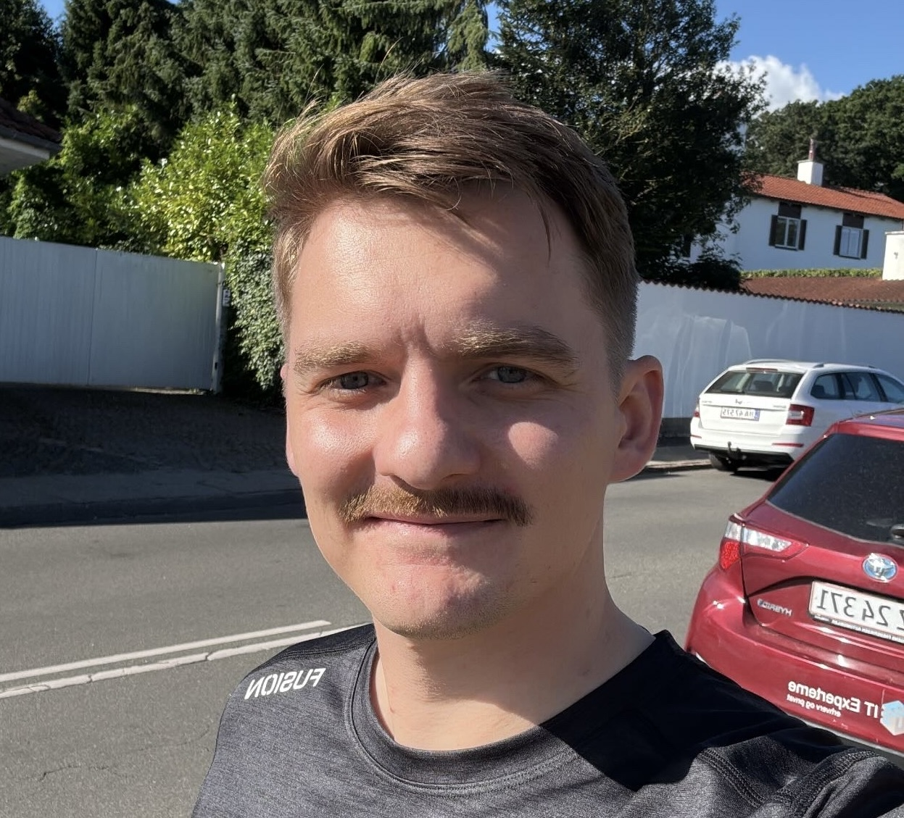
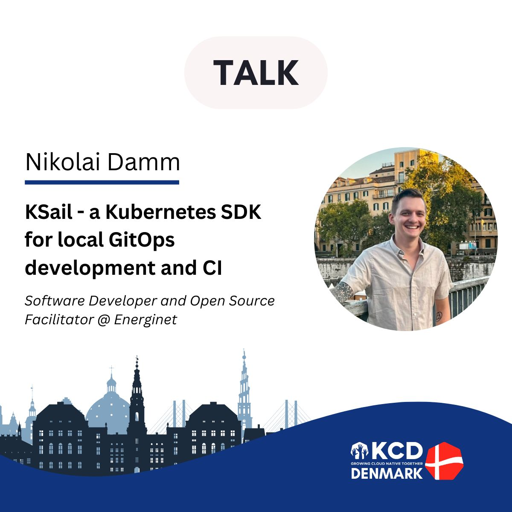
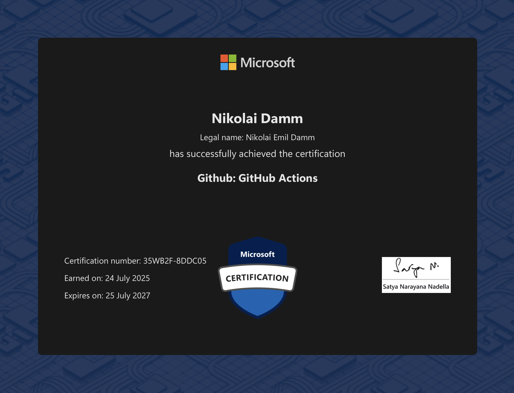
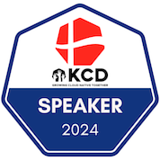
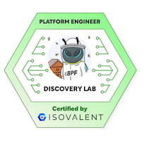
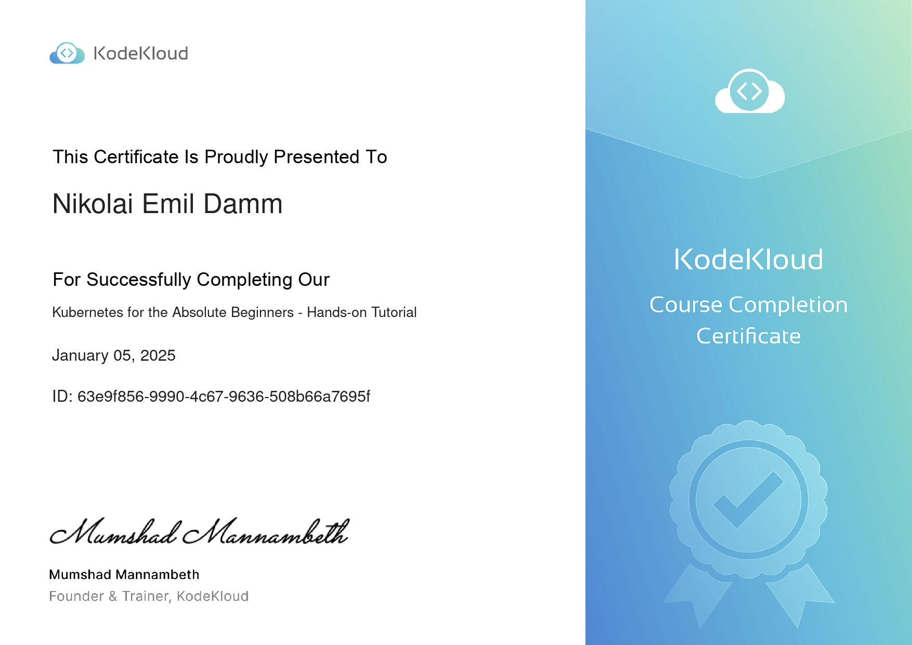
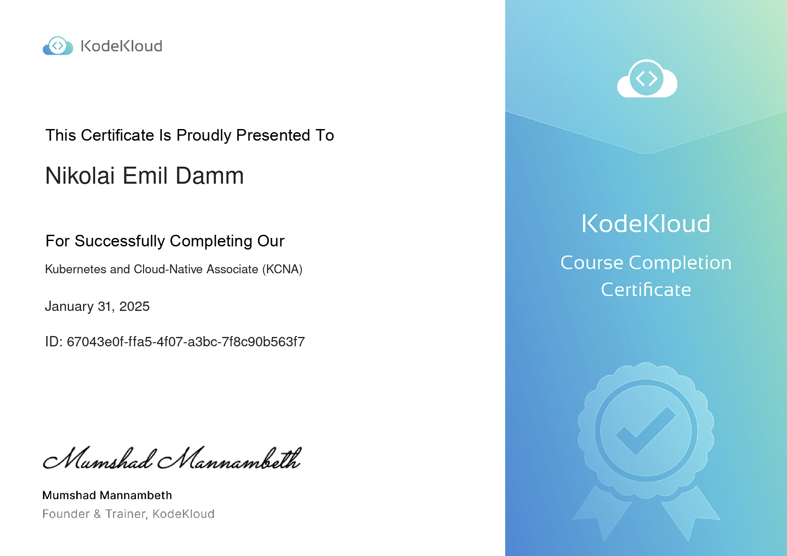

# Hi there 👋🏻☸️

<div align="center">
  
</div>

## About Me 📝

> **Name**: Nikolai Emil Damm 👨🏻
>
> **Alias**: devantler 🧑🏻‍💻
>
> **Nationality**: Danish 🇩🇰
>
> **Languages**: Danish, English 🌍
>
> **Location**: Haderslev, Denmark 📍
>
> **Time Zone**: Central European Time (CET) ⏰
>
> **Pronouns**: He/Him ♂
>
> **Personal Interests**: Socializing, CrossFit, Running, Gaming, Technology, Music 🗣️🏋🏻‍♀️🏃🏻🎮📱🎧
>
> **Education**: MSc in Software Engineering 🎓
>
> **Occupation**: Developer Experience Engineer 🧑🏻‍💻☸️

As a software engineer, I have a strong passion for modern software development practices and technologies. I truly believe in the power of open-source software, especially its ability to spark innovation and encourage collaboration. I'm a big fan of the Cloud Native Computing Foundation (CNCF) and appreciate their work in promoting the use of cloud-native technologies. I believe that by working together on important software, we can tackle the challenges we face today and in the future.

```csharp
public class DevProfile {
  public FavLang FavLang { get; set; } = FavLang.CSharp;
  public string[] Skills { get; set; } = {
    "C#/.NET",
    "Go",
    "Kubernetes",
    "Docker",
    "Infrastructure as Code",
    "CNCF Tools and Technologies",
    "And much much more"
  };
  public string[] Interests { get; set; } = {
    "Modern approaches to bridge OT and IT",
    "Simplifying Software Development and Operations",
    "Making Software Development Fun and Enjoyable",
    "Incorparating User Feedback early and often",
    "Testing Everything",
    "Automating Everything",
    "Sharing Knowledge through Open Source",
    "Advocating 'X as Code' approaches",
    "Building on top of the shoulders of giants"
  };
}
```

## Talks and Presentations 🎤

### KSail - a Kubernetes SDK for local GitOps development and CI <span style="float:right">KCD Denmark 2024</span>

<div align="center">
  <a href="https://youtu.be/Q-Hfn_-B7p8?si=2Uec_kld--fNw3gm" target="_blank" style="display: block; margin: 0 auto;">
    <br>
    🎥 Watch the talk! 🎥
  </a>
</div>

This talk presents KSail to the world. The talk demonstrates the core capabilities of KSail, and how it enables developers to shift-left Kubernetes operation and development practices. You will see first-hand how KSail can simplify and empower local development, and CI workflows. The talk is a mix of conceptual explanations and live demos.

The talk also presents the roadmap for KSail along with an open invitation to the community to contribute to the project.

## Occupation 💼

Years of experience in software development have given me a solid foundation in modern software development practices and technologies. I have worked on a wide range of projects, from developing and maintaining e-commerce platforms to creating and operating cloud-native solutions. I have a strong passion for learning and sharing knowledge, and I'm always looking for new challenges and opportunities to grow as a software engineer. I have a sharp eye for detail and a strong focus on quality and simplicity in everything I do. I love working with people who share my passion for software development and who are not afraid to challenge the status quo.

### Developer Experience Engineer <span style="float:right">Jun 2025 - Now</span>

_TV2, Odense_

As a Developer Experience Engineer at TV2, I am responsible for improving the developer experience for the product teams at TV2. This includes working on internal tools and platforms, as well as providing support and guidance to the teams on best practices for software development and operations. I work closely with the teams to understand their needs and challenges, and I strive to find solutions that make their work easier and more efficient. I also collaborate with other enabling teams within the organization to ensure that our tools and platforms are aligned with the overall goals and strategies of TV2.

## Achievements

## Certificates

<div align="center">
  
</div>

### [Credly Badges](https://www.credly.com/users/nikolai-emil-damm/badges)

<div align="left">
  
  
</div>

### Completed Courses

<div align="center">
  
  
</div>

## [Projects 📽️](https://devantler.com/projects)

| Project Name                                             | Description                                                                                                  | State  |
| -------------------------------------------------------- | ------------------------------------------------------------------------------------------------------------ | ------ |
| [🛥️🐳 KSail](https://github.com/devantler-tech/ksail)      | An all-in-one SDK for spinning up clusters and managing workloads—right from your own machine..              | Active |
| [☸️ Platform](https://github.com/devantler-tech/platform) | DevantlerTech Platform - including deployment artifacts for running the platform in CI/CD and in Talos Omni. | Active |

## [Templates 📁](https://devantler.com/templates)

| Template Name                                                        | Description                              | State  |
| -------------------------------------------------------------------- | ---------------------------------------- | ------ |
| [#️⃣ .NET Template](https://github.com/devantler-tech/dotnet-template) | A simple .NET template for new projects. | Active |
| [🦫 Go Template](https://github.com/devantler-tech/go-template) | A simple Go template for new projects.  | Active |


