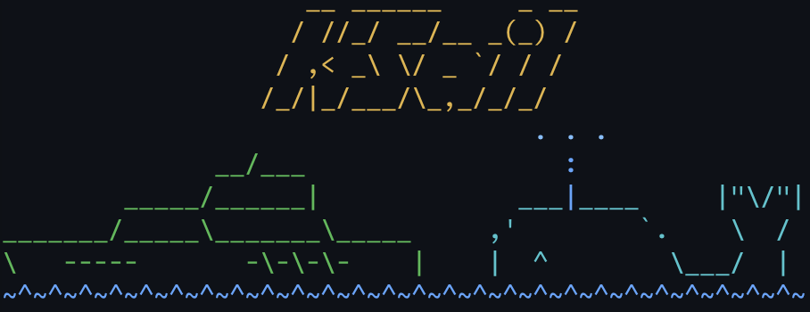
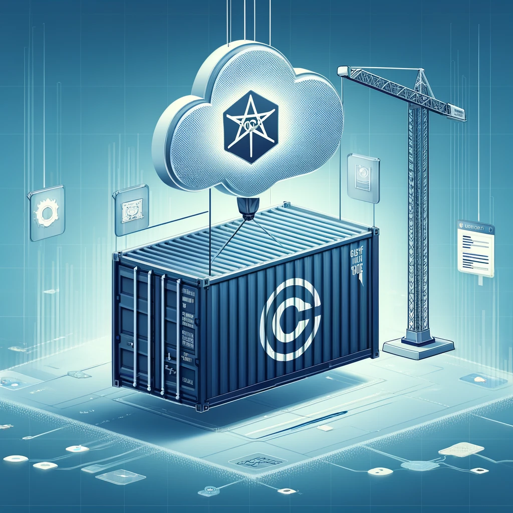
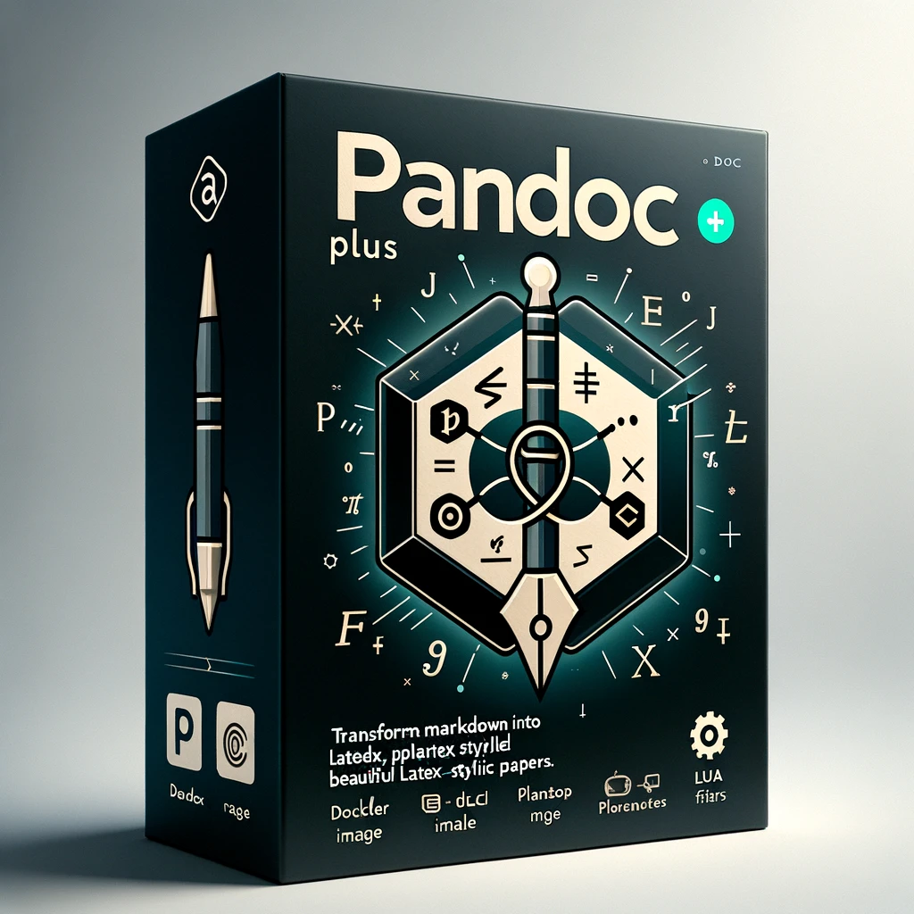
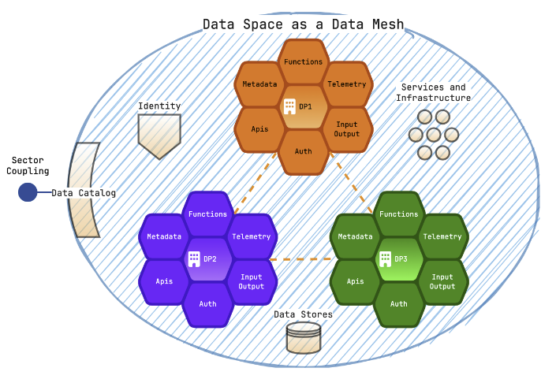
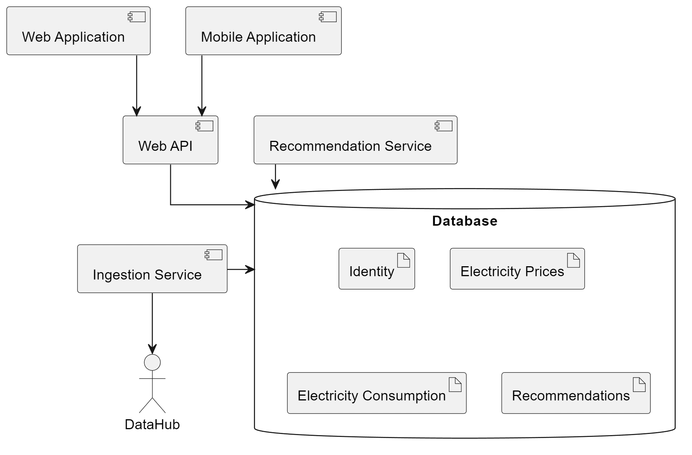
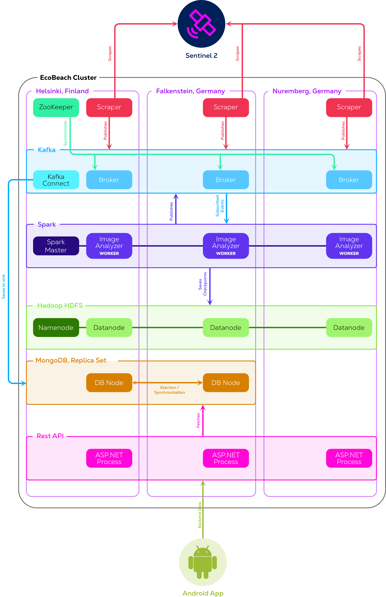
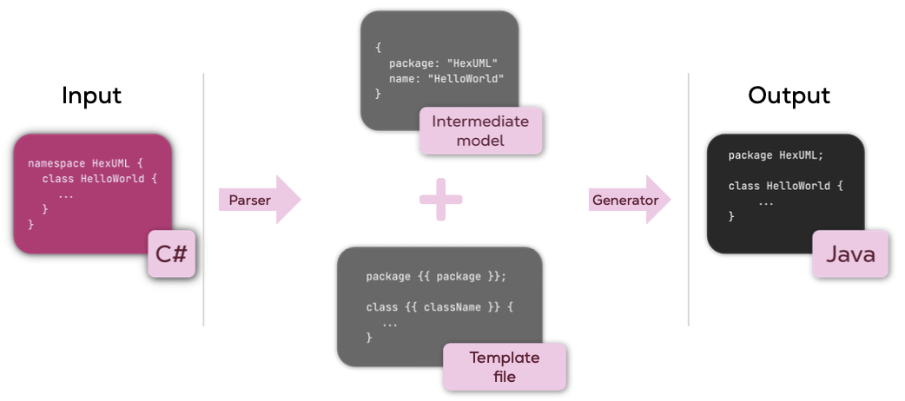

# Active Projects

These are the projects I am currently working on and actively maintaining. I'm always looking for contributors and feedback—feel free to visit each project's GitHub page and follow the contribution guidelines.

## [🛥️ KSail](https://github.com/devantler-tech/ksail)   

A CLI tool for provisioning GitOps-enabled Kubernetes clusters. It embeds common Kubernetes tools ([kubectl](https://kubernetes.io/docs/reference/kubectl/), [Helm](https://helm.sh/), [Kind](https://kind.sigs.k8s.io/), [K3d](https://k3d.io/), [Flux](https://fluxcd.io/), [ArgoCD](https://argo-cd.readthedocs.io/)) as Go libraries, requiring only [Docker](https://www.docker.com/) as an external dependency.

- **Local Development**: Spin up a cluster with GitOps enabled to instantly deploy your [Flux Kustomizations](https://fluxcd.io/flux/components/kustomize/kustomizations/)
- **CI Pipelines**: Test that your GitOps configurations successfully deploy applications
- **Multiple Distributions**: Support for [Kind](https://kind.sigs.k8s.io/), [K3d](https://k3d.io/), and [Talos](https://www.talos.dev/) clusters
- **GitOps Engines**: Support for [Flux](https://fluxcd.io/) and [ArgoCD](https://argo-cd.readthedocs.io/)
- **Secret Management**: Built-in [SOPS](https://github.com/getsops/sops) integration for encrypted secrets

📖 [Documentation](https://ksail.devantler.tech) • 📝 [Read about the journey from .NET to Go](/2025/05/07/building-ksail-from-shell-to-dotnet-to-go/)

## [☸️ Platform](https://github.com/devantler-tech/platform)   

A [Flux](https://fluxcd.io/) GitOps-based Kubernetes cluster running on a Mac Mini and Raspberry Pis in my home. It demonstrates a dev-friendly approach to working with Kubernetes using [Talos Linux](https://www.talos.dev/) as the operating system.

I use this cluster to learn and experiment with new technologies—striving to implement the latest CNCF projects to keep my skills sharp. I also run self-hosted services for entertainment, personal projects, and to own my own data.

**Key Technologies**: [Cilium](https://cilium.io/) (CNI), [Traefik](https://traefik.io/) (Ingress), [cert-manager](https://cert-manager.io/) (TLS), [SOPS](https://github.com/getsops/sops) (Secrets)

## [🔄 Reusable Workflows](https://github.com/devantler-tech/reusable-workflows) 

A collection of [reusable GitHub Actions workflows](https://docs.github.com/en/actions/using-workflows/reusing-workflows) that encapsulate common CI/CD patterns. Used across all DevantlerTech projects to ensure consistency and reduce duplication.

- **CI Workflows**: [Go](https://go.dev/) testing/linting, [.NET](https://dotnet.microsoft.com/) testing, documentation linting, GitOps validation
- **CD Workflows**: Cluster bootstrap, GitOps deploy, [GitHub Pages](https://pages.github.com/) publish, application/library releases
- **Automation**: Auto-merge for trusted bots, [semantic-release](https://semantic-release.gitbook.io/), TODO scanning, [Kyverno](https://kyverno.io/) policy sync

## [⚡ Actions](https://github.com/devantler-tech/actions) 

A collection of [composite GitHub Actions](https://docs.github.com/en/actions/creating-actions/creating-a-composite-action) that provide small, reusable components for CI/CD workflows.

- **Auto Merge**: Approve and auto-merge PRs from trusted bots/users
- **Cleanup GHCR**: Clean up old [GitHub Container Registry](https://docs.github.com/en/packages/working-with-a-github-packages-registry/working-with-the-container-registry) packages
- **Flux GitOps Deploy**: Push manifests to OCI and deploy using [Flux](https://fluxcd.io/)
- **Setup KSail**: Install [KSail](https://github.com/devantler-tech/ksail) CLI via [Homebrew](https://brew.sh/)
- **Install Cilium/Flux**: Install [Cilium](https://cilium.io/) and [Flux](https://fluxcd.io/) in Kubernetes clusters
- **TODOs**: Create GitHub issues from TODO comments in code

---

# Inactive Projects

These projects are no longer actively maintained, but I still think they are interesting, and I would love to pick them up again if I find the time or opportunity to do so.

---

# Completed Projects

Projects that have reached their end of life or I no longer actively maintain.

## [🚚 OCI Artifacts](https://github.com/devantler/oci-artifacts)  

A spin-off from my Homelab project that simplifies GitOps deployments by distributing [Kustomize](https://kustomize.io/) and [Flux HelmRelease](https://fluxcd.io/flux/components/helm/helmreleases/) components via [OCI](https://opencontainers.org/) registries. This approach—inspired by shared libraries in traditional programming—allows deploying applications with a single line of code while maintaining the flexibility of regular [Kustomize](https://kustomize.io/) and [Helm](https://helm.sh/) charts.

The OCI Artifacts use [Flux Post Build Variables](https://fluxcd.io/flux/components/kustomize/kustomizations/#post-build-variable-substitution) to inject values into components, exposing configurable settings that users can provide when deploying.

## [⬡ Data Product](https://github.com/devantler/data-product) 

My master thesis project: a data product inspired by the [Data Mesh](https://www.datamesh-architecture.com/) architectural pattern and [Zhamak Dehghani's book](https://www.oreilly.com/library/view/data-mesh/9781492092384/). Built in [.NET](https://dotnet.microsoft.com/) using [Source Generators](https://learn.microsoft.com/en-us/dotnet/csharp/roslyn-sdk/source-generators-overview) to create data products from schema definitions and YAML configuration.

Users could define their data product in YAML and reference a schema to generate REST, GraphQL, streaming, observability, and more—all out of the box. The project was containerized for deployment to various orchestrators and follows [CNCF](https://www.cncf.io/) best practices.

📄 [Read the thesis](../assets/pdfs/thesis.pdf)

## [✍🏻 Pandoc Plus](https://github.com/devantler/pandoc-plus)  

A Docker image that packages [Pandoc](https://pandoc.org/) with [LaTeX](https://www.latex-project.org/), [PlantUML](https://plantuml.com/), and Lua filters to create LaTeX-styled scientific papers from Markdown. The image includes all necessary tools to produce high-quality papers with beautiful transformations of Markdown syntax to LaTeX best practices.

Being a Docker image makes it trivial to use in CI pipelines—enabling you to write scientific papers following software development best practices.

📄 [Example output: My thesis](../assets/pdfs/thesis.pdf)

## [🤖 Star Wars Site](https://github.com/devantler/star-wars-site)   

A Star Wars-themed site built during an [Umbraco](https://umbraco.com/) hiring process to showcase [.NET](https://dotnet.microsoft.com/) and Umbraco skills. Built as a [Blazor WebAssembly](https://learn.microsoft.com/en-us/aspnet/core/blazor/) app fetching data from [Umbraco Heartcore](https://umbraco.com/products/umbraco-heartcore/), deployed to a [HashiCorp Nomad](https://www.nomadproject.io/) cluster for learning purposes.

The site is no longer running (the Heartcore instance was temporary), but the source code remains available!

---

# School Projects

Projects completed during my Software Engineering studies at the [University of Southern Denmark](https://www.sdu.dk/en). These showcase my dedication to exploring new technologies and approaches to software engineering.

## 🌏 Exploration of State-of-the-Art Technology, Architectures and Tools to Create Future-Proof Data Spaces

### ⭐️ Graded 12/12 10th semester (MSc thesis)

An exploration of whether a [data space](https://internationaldataspaces.org/) can be implemented as a [data mesh](https://www.datamesh-architecture.com/), focusing on challenges and benefits for collaboration in the Danish energy sector. The study uses constructivism and the constructive research approach, employing grounded theory for fieldwork.

The research culminated in a prototype of a data mesh's central component—a data product—demonstrating that the data mesh approach can be successfully applied to data spaces for better domain separation, discoverability, observability, and governance.

📄 [Read the thesis](../assets/pdfs/thesis.pdf)

## 📊 Power Price Assistant

### ⭐️ Graded 12/12 9th semester

A web app simulating a system that advises on electricity provider selection based on consumption patterns and user priorities.

## 🏗️ Simulated Assembly Line

### ⭐️ Graded 12/12 8th semester

<video class="lazy" width="640" height=" 360" controls>
  <source data-src="../assets/videos/simulated-assembly-line.mp4"  type="video/mp4">
</video>

A simulated assembly line with a self-constructed crane, rotating disk, and web camera. Programmed using our own Domain-Specific Language (DSL) that generated a client for execution. The client used [MQTT](https://mqtt.org/) to communicate with the embedded system.

## 🌊 EcoBeach

### ⭐️ Graded 7/12 7th semester

A big data system that scraped satellite imagery from the [Sentinel-2](https://sentinel.esa.int/web/sentinel/missions/sentinel-2) satellite and processed them to analyze shoreline changes over time. Included an Android app for data visualization.

📄 [Read the report](../assets/pdfs/ecobeach.pdf)

## ⬣ HexUML

### ⭐️ Graded 12/12 6th semester (BSc thesis)

A generic transpiler framework for translating between text sources (e.g., Java to C#). The framework was used to generate [AnyLogic](https://www.anylogic.com/) models for a web application (EcosystemMapGenerator) I built for [SDU](https://www.sdu.dk/) during my work as a student programmer at the [Maersk Mc-Kinney Moller Institute](https://www.sdu.dk/en/om_sdu/institutter_centre/mmmi_maersk_telecom) (February 2021 – November 2021).
