Creating good GitHub issues is an underrated skill. A well-written issue saves hours of back-and-forth during refinement, reduces misunderstandings, and helps developers focus on solving problems rather than deciphering vague descriptions. But writing those issues takes time — time spent investigating code, formulating problems clearly, and ensuring the description meets team expectations.

I've found a workflow that dramatically reduces this overhead: using GitHub Copilot with Claude Opus 4.5 to analyze codebases and generate structured, impactful issues.

- [The Problem with Traditional Issue Creation](#the-problem-with-traditional-issue-creation)
- [My AI-Assisted Workflow](#my-ai-assisted-workflow)
  - [Step 1: Select the Context](#step-1-select-the-context)
  - [Step 2: Prompt with Intent and Reference Templates](#step-2-prompt-with-intent-and-reference-templates)
  - [Step 3: Review and Refine](#step-3-review-and-refine)
- [Structured Templates Are Key](#structured-templates-are-key)
  - [Bug Reports](#bug-reports)
  - [Feature Requests](#feature-requests)
  - [Improvement Katas](#improvement-katas)
- [A Real Example: From Prompt to Issue](#a-real-example-from-prompt-to-issue)
  - [What I Typed](#what-i-typed)
  - [What the AI Produced](#what-the-ai-produced)
  - [The Result](#the-result)
- [Real-World Impact](#real-world-impact)
  - [Personal Projects (KSail)](#personal-projects-ksail)
  - [Professional Work (TV 2)](#professional-work-tv-2)
- [When This Approach Doesn't Work](#when-this-approach-doesnt-work)
- [Tips for Getting the Best Results](#tips-for-getting-the-best-results)
  - [1. Be Specific About Scope](#1-be-specific-about-scope)
  - [2. Describe the Outcome, Not the Solution](#2-describe-the-outcome-not-the-solution)
  - [3. Always Reference Your Templates](#3-always-reference-your-templates)
  - [4. Review with Fresh Eyes](#4-review-with-fresh-eyes)
  - [5. Iterate on Complex Issues](#5-iterate-on-complex-issues)
- [Conclusion](#conclusion)

## The Problem with Traditional Issue Creation

Before adopting this workflow, creating a proper issue typically involved:

1. **Investigation**: Digging through code to understand the current state
2. **Analysis**: Identifying what's wrong or what's missing
3. **Formulation**: Translating technical findings into clear descriptions
4. **Structuring**: Ensuring the issue follows team conventions
5. **Review**: Double-checking that nothing important was missed

For a complex feature or bug, this process could easily take 1-2 hours — and that's assuming you're already familiar with the codebase.

## My AI-Assisted Workflow

My approach flips the script. Instead of manually investigating and writing, I give GitHub Copilot a clear but short description of the expected outcome or problem, and let Claude Opus 4.5 do the heavy lifting.

```mermaid
flowchart LR
    A["📁 Select Context"] --> B["💬 Prompt with Intent"]
    B --> C["📋 Reference Templates"]
    C --> D["🤖 AI Analysis"]
    D --> E["✅ Review & Refine"]
    E --> F["🎫 Create Issue"]
```



Here's how it works:

### Step 1: Select the Context

I attach the relevant folders, repositories, or files in VS Code Chat Agent mode. This might be:

- A specific service or module where I've noticed a problem
- Multiple related files that need coordinated changes
- An entire project when planning a new feature

### Step 2: Prompt with Intent and Reference Templates

I provide Copilot with a concise description of what I need, always referencing my issue templates. The key is being clear about:

1. **What to analyze** — the specific area of the codebase
2. **What the problem or goal is** — the expected outcome
3. **Which template to use** — this ensures the output follows team conventions

Here are some example prompts I use:

**For a bug:**

```text
Analyze the metrics-server installation in pkg/svc/installers/ and identify
why it's not working with the latest Kubernetes version. Use my bug issue
template from .github/ISSUE_TEMPLATE/BUG.yaml to create the issue.
```

**For a feature:**

```text
Investigate the current cluster provisioning flow in pkg/svc/provisioners/
and create a feature issue for adding Hetzner Cloud support. Follow the
feature template from .github/ISSUE_TEMPLATE/FEATURE.yaml.
```

**For process improvements**

```text
Our team's refinement sessions often run over time because issues lack context.
Create an improvement kata issue to improve how we write and prepare issues
before refinement, using the KATA.yaml template.
```

### Step 3: Review and Refine

Opus 4.5 generates a complete issue that typically requires minimal editing. The model is remarkably good at:

- Understanding codebases and their architecture
- Identifying the actual problem, not just symptoms
- Writing clear, actionable descriptions
- Following the template structure precisely

## Structured Templates Are Key

The secret sauce isn't just the AI — it's combining AI with well-designed issue templates. I use YAML-based GitHub issue templates stored in `.github/ISSUE_TEMPLATE/` that enforce structure and guide both humans and AI to provide the right information.

### Bug Reports

For bugs, my template captures the essential debugging information:

```yaml
name: 🐛 Bug
description: An unexpected problem or behavior.
title: "[bug]: "
type: Bug
body:
  - type: textarea
    id: expected_behavior
    attributes:
      label: Expected Behavior
      description: Describe what you expected to happen.
    validations:
      required: true

  - type: textarea
    id: actual_behavior
    attributes:
      label: Actual Behavior
      description: Describe what actually happened.
    validations:
      required: true

  - type: textarea
    id: steps
    attributes:
      label: Steps to Replicate
      description: List the steps to replicate the bug.
      value: |
        1. Step 1
        2. Step 2
        3. Step 3
    validations:
      required: true
```

When I prompt Copilot with something like _"The cluster fails to start when Cilium is enabled on ARM64 — create a bug issue"_, it produces output that maps directly to these fields with accurate technical details.

### Feature Requests

For features, I use the standard agile user story format with acceptance criteria:

```yaml
name: 🚀 Feature
description: Submit a new feature as a user story with acceptance criteria.
title: "[feature]: "
type: Feature
body:
  - type: textarea
    id: user_story
    attributes:
      label: User Story
      description: Use the standard agile story format.
      value: |
        **As a** [role],
        **I want** [an action or feature],
        **So that** [a reason or benefit].
    validations:
      required: true

  - type: textarea
    id: acceptance_criteria
    attributes:
      label: Acceptance Criteria
      description: Provide a task list of conditions that must be satisfied.
      value: |
        - [ ] Criteria 1: Describe the first acceptance criterion here.
        - [ ] Criteria 2: Describe the second acceptance criterion here.
        - [ ] Criteria 3: Describe additional criteria as needed.
    validations:
      required: true
```

The user story format forces clarity about _who_ benefits, _what_ they need, and _why_ it matters. Claude Opus 4.5 excels at filling this in with genuine user-centric thinking rather than developer-centric feature descriptions.

### Improvement Katas

For continuous improvement initiatives, I use the [Toyota Kata framework](https://en.wikipedia.org/wiki/Toyota_Kata). Unlike bugs and features, katas focus on human processes rather than code — things like team communication, workflow bottlenecks, or development practices.

```yaml
name: 🥋 Improvement Kata
description: Use the Improvement Kata framework for structured problem-solving.
title: "[kata]: "
type: Kata
body:
  - type: textarea
    id: problem
    attributes:
      label: Problem
      description: Describe the current situation and why it is problematic.
      value: |
        Current situation:
        - ...

        Why this is problematic:
        - ...
    validations:
      required: true

  - type: textarea
    id: definition-of-awesome
    attributes:
      label: Definition of Awesome
      description: How would we like it to be? Describe the ideal state.
    validations:
      required: true

  - type: textarea
    id: next-target-condition
    attributes:
      label: Next Target Condition
      description: X weeks from now, what has changed?
    validations:
      required: true

  - type: textarea
    id: actions
    attributes:
      label: Actions
      description: List of actions to take toward the target condition.
      value: |
        - [ ] **Action 1:** ...
        - [ ] **Action 2:** ...
        - [ ] **Action 3:** ...
    validations:
      required: true
```

This template is particularly powerful with AI assistance. Opus 4.5 can help structure observations about team dynamics, identify process bottlenecks, and propose actionable improvement experiments — turning vague frustrations into measurable improvement initiatives.

You can find all my issue templates in the [devantler-tech/.github repository](https://github.com/devantler-tech/.github/tree/main/.github/ISSUE_TEMPLATE).

## A Real Example: From Prompt to Issue

To show this workflow in action, here's a real issue I created for KSail using this approach.

### What I Typed

```text
Analyze the existing addon patterns in pkg/svc/installer/ (cert-manager,
metrics-server, CNI, CSI) and create a feature issue for adding a
--policy-engine flag that supports Kyverno and Gatekeeper. Use the
FEATURE.yaml template from .github/ISSUE_TEMPLATE/.
```

That's it — one sentence describing what I wanted, plus a reference to existing patterns and my template.

### What the AI Produced

Copilot analyzed the codebase, identified all the integration points, and generated [this issue](https://github.com/devantler-tech/ksail/issues/1614):

```md
**[feature]: Add `--policy-engine` flag to install Kyverno or Gatekeeper**

**User Story**

**As a** KSail user,
**I want** to install a policy engine (Kyverno or Gatekeeper) when creating a cluster,
**So that** I can enforce policies on my workloads from the start without manual post-provisioning steps.

**Background**

Policy engines are essential for enforcing security, compliance, and best practices in Kubernetes clusters. Adding first-class support for policy engines follows the same pattern as existing addons (cert-manager, metrics-server, CNI, CSI, GitOps engines).
```

The AI didn't stop there. It analyzed the existing addon implementations and produced detailed implementation requirements:

```markdown
### Implementation Requirements

#### 1. API Types (`pkg/apis/cluster/v1alpha1/`)

- [ ] Add `PolicyEngine` enum type with values `PolicyEngineNone`, `PolicyEngineKyverno`, `PolicyEngineGatekeeper`
- [ ] Add `PolicyEngine PolicyEngine` field to `ClusterSpec` struct
- [ ] Implement `Set()`, `String()`, `Type()` methods for pflags compatibility

#### 2. Installer Service (`pkg/svc/installer/`)

- [ ] Create `pkg/svc/installer/kyverno/installer.go` implementing `installer.Installer`
- [ ] Create `pkg/svc/installer/gatekeeper/installer.go` implementing `installer.Installer`

#### 3. CLI Integration (`cmd/cluster/`)

- [ ] Add `--policy-engine` flag to `init.go` and `create.go`
```

It even included the correct Helm chart references:

| Engine     | Repo URL                                                | Chart                   | Default Namespace   |
| ---------- | ------------------------------------------------------- | ----------------------- | ------------------- |
| Kyverno    | `https://kyverno.github.io/kyverno/`                    | `kyverno/kyverno`       | `kyverno`           |
| Gatekeeper | `https://open-policy-agent.github.io/gatekeeper/charts` | `gatekeeper/gatekeeper` | `gatekeeper-system` |

### The Result

The generated issue required minimal editing — just some polish to the acceptance criteria. And here's the kicker: I implemented the entire feature using another single prompt:

```text
Implement https://github.com/devantler-tech/ksail/issues/1614
```

The issue was so well-structured that Copilot could follow it as a specification. Total time from idea to merged PR: about 2 hours of active work, and about 8 hours in total. Imaging how much work you could do if you parallelized this across multiple issues!

## Real-World Impact

I use this approach in two contexts:

### Personal Projects (KSail)

For [KSail](https://github.com/devantler-tech/ksail), my Kubernetes SDK for local GitOps development, this workflow has been invaluable. When I notice something that needs improvement, I can quickly generate a detailed issue without interrupting my flow. The AI understands the Go codebase, the embedded tool clients, and the overall architecture — producing issues that accurately describe both problems and solutions.

### Professional Work (TV 2)

At TV 2, where I work, this approach has had an even bigger impact.


**Time saved on investigation**: Instead of spending hours digging through unfamiliar code, I can generate a comprehensive issue in 5 minutes.

**Better refinement sessions**: When issues arrive at refinement already following our template and containing accurate technical details, the team can focus on alignment, estimation and planning rather than clarification.

**Senior engineer quality**: Opus 4.5 is remarkably capable at writing issues that meet senior software engineers' expectations. The descriptions are technical enough to be useful, clear enough to be actionable, and structured enough to fit our workflow.

**Consistency**: Every issue follows the same format, making it easier for team members to find the information they need.

## When This Approach Doesn't Work

This workflow isn't magic. There are situations where AI-assisted issue creation falls short:

**Issues requiring stakeholder input**: If the issue depends on business decisions, user research, or information that isn't in the codebase, the AI can't help much. It can structure the issue, but it can't interview your product owner. You can still feed in those details manually, but the time savings are reduced.

**Highly sensitive or confidential context**: Be careful about what context you share with AI tools. If the issue involves security vulnerabilities, credentials, or proprietary business logic, you may need to write it manually or heavily redact the AI's output.

**Cross-repository or external dependencies**: When issues span multiple repositories or depend on external systems the AI can't see, the generated context may be incomplete. Always verify external references.

**Vague problems without symptoms**: If you can't articulate even a rough description of what's wrong, the AI can't investigate effectively. "Something feels slow" is too vague — "API response times have increased" gives the AI something to search for.

**Novel codebases**: The AI is remarkably good at pattern recognition. In well-structured codebases with consistent patterns (like KSail's addon system), it excels. In chaotic legacy codebases with no clear patterns, results vary.

For these situations, I fall back to traditional issue creation — but I still use my templates to ensure structure.

## Tips for Getting the Best Results

After a month of using this workflow, here's what I've learned:

### 1. Be Specific About Scope

Tell Copilot exactly which files or folders to analyze. The more focused the context, the more accurate the output.

### 2. Describe the Outcome, Not the Solution

Say "users can't access the metrics endpoint" rather than "fix the metrics-server RBAC". Let the AI investigate and propose solutions.

### 3. Always Reference Your Templates

Explicitly mention your issue templates. This ensures the output follows your team's conventions.

### 4. Review with Fresh Eyes

While the generated issues are usually excellent, always read them as if you were a team member seeing them for the first time. Add context that only you know.

### 5. Iterate on Complex Issues

For large features, start with a high-level issue, then generate sub-issues for specific components.

## Conclusion

GitHub Copilot with Claude Opus 4.5 has transformed how I create issues. What used to take hours now takes 5-10 minutes, and the quality is often higher than what I'd produce manually.


The combination of AI analysis and structured templates creates a workflow that's:

- **Fast**: Minimal time spent on investigation
- **Consistent**: Every issue follows the same format
- **Accurate**: The AI understands codebases deeply
- **Team-friendly**: Issues arrive at refinement ready to discuss

If you're spending too much time writing issues, or if your team's refinement sessions are slowed down by unclear issue descriptions, give this workflow a try. The upfront investment in good issue templates pays dividends when combined with AI-powered generation, but also if you write issues manually.

**Want to try this yourself?** Fork my [issue templates](https://github.com/devantler-tech/.github/tree/main/.github/ISSUE_TEMPLATE) and adapt them to your team's conventions. The combination of structured templates and AI-powered generation might just change how you work.

The future of software development isn't AI replacing developers — it's AI handling the tedious parts so developers can focus on what matters. I am personally ecstatic about how this workflow has improved my productivity and the quality of my work. I hope it helps you too!

If you have further questions or want to discuss this approach, feel free to comment below or send me a message or [contact me](https://devantler.tech/contact/).

---

_This blog post was written with the assistance of GitHub Copilot and Claude Opus 4.5 — the motor of the workflow it describes. The content reflects my genuine experiences and opinions; the AI helped structure and articulate them._
